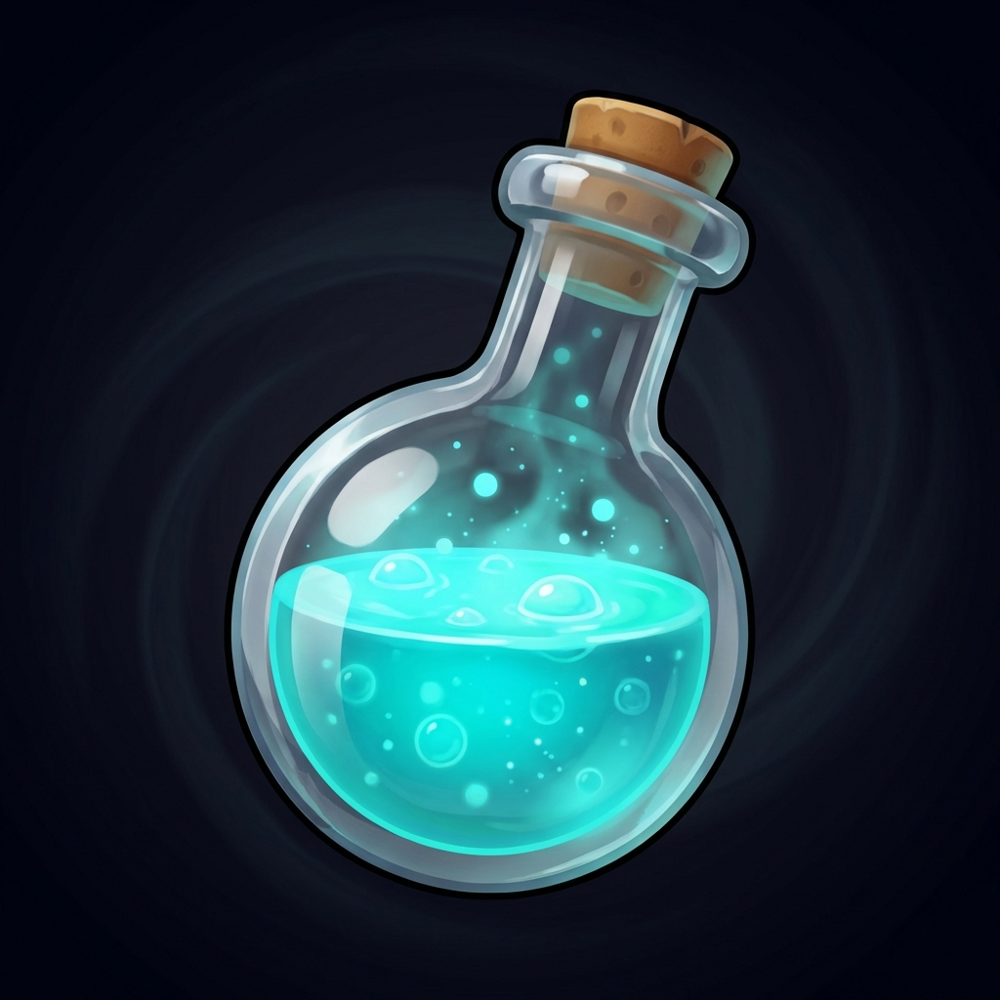

# Color Lab 🧪

A premium color-mixing puzzle game with a cosmic laboratory theme. Mix colors to match targets across 300+ levels and multiple game modes!

<p align="center">
  
</p>

## 🎮 Game Features

### 🎯 Multiple Game Modes
- **Classic Mode**: 300 progressive levels with increasing difficulty
- **Time Attack**: Race against the clock to match colors
- **Color Echo**: Random challenging targets for advanced players
- **Chaos Lab**: Unstable laboratory with random events and disasters

### 🎨 Core Gameplay
- Intuitive RGB color mixing with White and Black modifiers
- Real-time match percentage indicator
- Strategic drop limit system
- Blind mode challenges for expert players

### 🏆 Progression & Rewards
- 3-star rating system per level
- Coin economy for unlocking upgrades
- 20+ achievements to unlock
- Detailed statistics tracking
- Combo system rewarding consecutive perfect matches

### 🔬 Customization
- **Lab Upgrade Hub**: 20+ customization items
  - Backgrounds (Cosmic, Nebula, Aurora, etc.)
  - Lighting effects (Neon, Bioluminescent, etc.)
  - Work surfaces (Steel, Marble, Holographic, etc.)
  - Beaker stands (Basic, Crystal, Floating, etc.)
- Multiple beaker skins
- Color gallery with discovery system

### 🛠️ Helpers & Power-ups
- **Undo**: Reverse your last drop
- **Extra Drops**: Increase your drop limit
- **Help Drop**: Auto-add the next needed color
- **Reveal Color**: Temporarily reveal hidden colors in blind mode

### ♿ Accessibility
- **4 Languages**: English, Arabic, Spanish, French
- **Colorblind Modes**: Protanopia, Deuteranopia, Tritanopia support
- **High Contrast Mode**: Enhanced visibility
- **Reduced Motion**: For motion-sensitive players
- **Haptic Feedback**: Customizable vibration

### 🎵 Audio & Visuals
- Cosmic laboratory aesthetic with glassmorphism
- Dynamic particle effects and animations
- Adaptive background music per game mode
- Professional sound effects
- Smooth 60 FPS gameplay

## 📱 Technical Details

- **Built with**: Flutter & Flame game engine
- **Platform**: Android 5.0+ (API 21)
- **Orientation**: Portrait only
- **Storage**: Offline-first with local save system
- **Performance**: Auto-optimization for low-end devices

## 🚀 Getting Started

### Prerequisites
- Flutter SDK (3.0.0 or higher)
- Android Studio / VS Code
- Android device or emulator

### Installation

1. Clone the repository:
```bash
git clone https://github.com/dvzeyad/color_mixing_deductive.git
cd color_mixing_deductive
```

2. Install dependencies:
```bash
flutter pub get
```

3. Run the app:
```bash
flutter run
```

### Building for Release

#### Android (APK):
```bash
flutter build apk --release
```

#### Android (App Bundle for Play Store):
```bash
flutter build appbundle --release
```

The output will be in `build/app/outputs/`.

## 📂 Project Structure

```
lib/
├── components/        # Game components (beaker, particles, effects)
├── core/             # Core game logic (color mixing, levels, saves)
├── helpers/          # Utility classes (audio, haptics, themes)
├── overlays/         # UI overlays (menus, HUD, dialogs)
│   ├── hud/         # Heads-up displays
│   ├── menus/       # Game menus
│   ├── navigation/  # Navigation screens
│   └── system/      # System overlays
└── main.dart         # App entry point

assets/
├── audio/           # Music and sound effects
├── images/          # Game images and icons
└── levels.json      # Level definitions
```

## 🎯 Gameplay Tips

1. **Start Simple**: Master the basics in Classic Mode before trying other modes
2. **Use Helpers Wisely**: Helpers are limited - save them for difficult levels
3. **Watch the Percentage**: The match indicator helps guide your mixing
4. **Experiment**: Don't be afraid to try different color combinations
5. **Earn Coins**: Complete levels with 3 stars to maximize coin rewards
6. **Customize Your Lab**: Unlock upgrades to personalize your experience

## 🏅 Achievements

Unlock 20+ achievements by:
- Completing levels perfectly
- Building combo streaks
- Discovering rare colors
- Mastering different game modes
- Customizing your laboratory

## 📊 Statistics

Track your progress with detailed statistics:
- Total levels completed
- Perfect matches achieved
- Highest combo streak
- Total drops used
- Colors discovered
- Time played per mode

## 🌍 Localization

Color Lab supports 4 languages:
- 🇬🇧 English
- 🇸🇦 Arabic (العربية)
- 🇪🇸 Spanish (Español)
- 🇫🇷 French (Français)

## 🔒 Privacy

Color Lab respects your privacy:
- **No personal data collection**
- **No internet required** (fully offline)
- **No ads or tracking**
- All data stored locally on your device

See [PRIVACY_POLICY.md](PRIVACY_POLICY.md) for details.

## 📝 License

Copyright © 2026 DV Zeyad. All rights reserved.

## 📧 Contact

- **Developer**: DV Zeyad
- **Email**: dvzeyad@gmail.com

## 🙏 Acknowledgments

- Built with [Flutter](https://flutter.dev/)
- Game engine: [Flame](https://flame-engine.org/)
- Icons: [Material Design Icons](https://fonts.google.com/icons)

---

**Enjoy mixing colors in the cosmic laboratory!** 🧪✨
